# VERQIA — ERD V1.3 (relations)

Diagramme Mermaid des 41 tables. Détail des colonnes et contraintes : `DATA_CONTRACT_V1.md`.
Les références aux événements (`trigger_event_id`, `event_receipts.event_id`) sont **logiques** (pas de FK) car `events` est partitionnée.

```mermaid
erDiagram
    organizations ||--o{ memberships : has
    users ||--o{ memberships : belongs
    organizations ||--|| org_settings : configures
    organizations ||--o{ org_holidays : defines
    organizations ||--o{ customers : owns
    organizations ||--o{ subscriptions : subscribes
    plans ||--o{ subscriptions : priced_by

    customers ||--o{ customer_contacts : has
    customers ||--o{ invoices : billed
    customers ||--o{ payments : pays

    invoices ||--o{ invoice_items : contains
    invoices ||--o{ invoice_state_history : tracks
    invoices ||--o{ invoice_disputes : disputed

    payments ||--o| payment_reversals : reversed
    payments ||--o{ payment_allocations : allocates
    invoices ||--o{ payment_allocations : settled_by
    payment_allocations |o--o{ payment_allocations : reverses

    invoices |o--o{ promises : promised_on
    customers ||--o{ promises : promised_by
    promises ||--o{ promise_history : tracks

    invoices ||--o{ collection_actions : targets
    collection_actions ||--o{ collection_action_attempts : attempts
    invoices |o--o{ collection_holds : held
    customers |o--o{ collection_holds : held
    automations |o--o{ collection_holds : scoped_to
    message_templates |o--o{ collection_actions : uses
    message_templates |o--o{ notifications : renders

    customers ||--o| risk_profiles : current_risk
    customers ||--o{ risk_snapshots : risk_history
    invoices ||--o| priority_items : current_priority
    invoices ||--o{ priority_snapshots : priority_history

    automations ||--o{ automation_versions : versions
    automations |o--o| automation_versions : current
    automations ||--o{ automation_executions : runs
    automation_versions ||--o{ automation_executions : executed_as
    automation_executions ||--o{ automation_execution_steps : steps
    automation_executions |o--o{ collection_actions : creates
    automation_executions |o--o{ approvals : requires
    collection_actions |o--o{ approvals : requires

    cashflow_runs ||--o{ cashflow_lines : lines
    invoices |o--o{ cashflow_lines : sourced_from
    payments |o--o{ cashflow_lines : realized_from
    customers |o--o{ cashflow_lines : sourced_from

    notifications ||--o{ notification_deliveries : deliveries
    collection_actions |o--o{ notifications : triggers
    customer_contacts |o--o{ notifications : addressed_to
    users |o--o{ notifications : addressed_to

    organizations ||--o{ import_batches : imports
    import_batches ||--o{ import_rows : stages
    import_batches |o--o{ customers : created_by_import
    import_batches |o--o{ invoices : created_by_import
    import_batches |o--o{ payments : created_by_import
```

## Tables hors diagramme (références logiques uniquement)

| Table | Raison |
|---|---|
| `events` | partitionnée ; référencée logiquement par `trigger_event_id`, `event_id`, `causation_id` |
| `event_receipts` | idempotence des handlers, clé `(event_id, handler_name)` |
| `idempotency_keys` | protection des `POST` sensibles |
| `audit_logs` | partitionnée ; référence `entity_type` + `entity_id` (polymorphe) |
| `events.import_batch_id` | référence logique vers `import_batches` (partitionnée, pas de FK) |

## Conventions non dessinées

- Les colonnes `*_by`, `assigned_to`, `recipient_user_id` pointent vers `users(id)` (table globale) ; ces FK ne sont pas tracées pour la lisibilité.
- `collection_actions` et `priority_items` portent `customer_id` et référencent `invoices(organization_id, id, customer_id)` : la cohérence facture ↔ client est garantie par la clé composite, sans FK directe vers `customers`. `promises` a en plus une FK directe vers `customers`, car `invoice_id` peut être NULL (promesse de niveau client).
- Une FK composite avec colonne nullable (`promises.invoice_id`) est en `MATCH SIMPLE` : elle n'est vérifiée que si la colonne est renseignée.

## Cardinalités clés à retenir

- `payment_allocations` est la **seule** source de vérité du solde d'une facture.
- `promises` : portée facture (`invoice_id` renseigné) ou client (`invoice_id` NULL), `customer_id` toujours renseigné. `approvals` : XOR exécution / action. `collection_holds` : portée facture / client / organisation.
- `automations.current_version_id` : FK circulaire différée vers `automation_versions`.
- `risk_profiles` est par client ; `priority_items` par facture.
